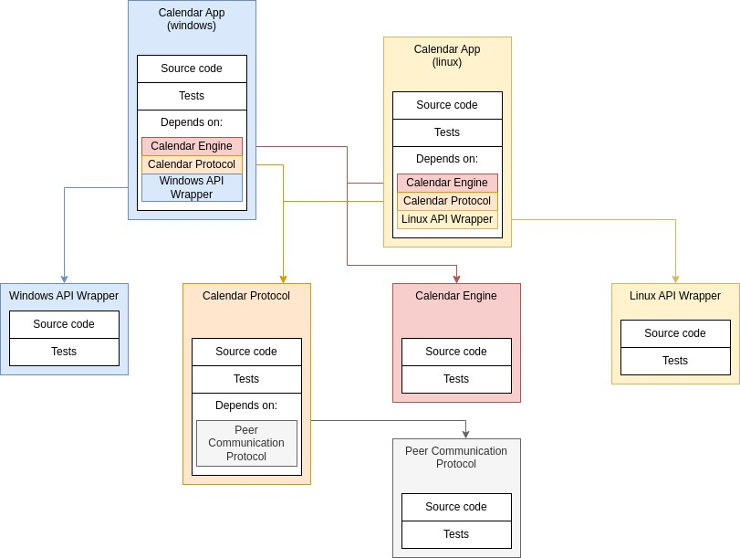

```
 ______              __              __   ______                    
|   __ \.----.-----.|__|.-----.----.|  |_|   __ \.---.-.-----.-----.
|    __/|   _|  _  ||  ||  -__|  __||   _|   __ <|  _  |__ --|  -__|
|___|   |__| |_____||  ||_____|____||____|______/|___._|_____|_____|
                   |___|
```

ProjecBase is a project orchestrator.
It helps setup and manage large projects, providing the necessary tooling for
working with each of the components.

Each component of the project can be viewed, executed and tested as a project
itself. They are git repositories, and depending on the presence of certain
files, instruct ProjectBase on how to set it and its dependencies up.

It uses git for version management, CMakeLists as the main build system and
Python to orchestrate all of this.

An example project structure can be found below. Each module can be built and ran, only requiring the repositories they depend on, whether this is for development or testing.

Such a scheme encourages:

1. Modularity: Each repository holds smaller logical functions
2. Efficiency: Only download/build/test what truly is required
3. Unit Testing: Easily focus on single components

All without sacrificing:

1. System testing: The tests from higher level repositories end up being the system tests!
2. Simplicity: ProjectBase is just a few scripts written in a beginner friendly language (python), with no big complex framework behind it
3. Adaptability: The build system (CMake) can easily integrate other build systems, and the provided CMakeList templates can act as a backbone for complex build procedures, or even be simply used to toggle your particular build procedure

Example Project Diagram:



Interested in how to start using ProjectBase? Checkout some [workflows](https://gitlab.com/brunoasmauricio/ProjectBase/-/wikis/workflows)!

See all available information in the [wiki](https://gitlab.com/brunoasmauricio/ProjectBase/-/wikis/home)!

ProjectBase is licensed under GNU General Public License Version 3

# TODO

- [ ] Allow config customization when creating a new project with new.py
  - [ ] Initial directory
  - [ ] Initial dependencies
  - [ ] Default README?
  - [ ] Default example?
  - [ ] Use options (y/n/a yes/no/all)
- [ ] Add support for a configuration system (i.e. Kconfig)
- [ ] Add support for some documentation system (i.e. doxygen)
- [ ] Investigate necessity/feasibility of sending strings into code
